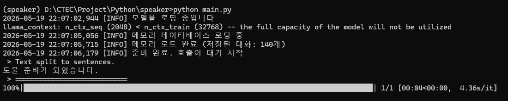
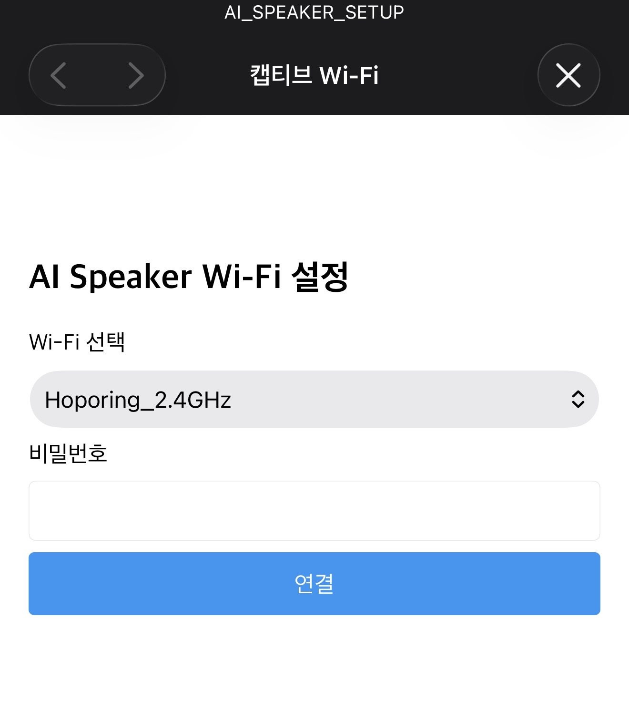
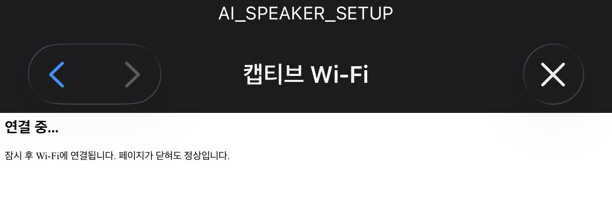

# AI-Speaker

Raspberry Pi 5 기반 완전 로컬 AI 음성 Assistant Pipeline.  
Wake Word 감지부터 TTS 응답까지 모든 처리를 온디바이스로 수행합니다.

---

## 실행 화면



---

## Wi-Fi 설정 (Captive Portal)

최초 부팅 시 `AI_SPEAKER_SETUP` AP에 접속하면 Captive Portal로 자동 연결됩니다.





---

## Pipeline 구조

```
Microphone Input
      │
      ▼
[Wake Word Detector] ── 호출어 미감지 시 대기
      │ 호출어 감지
      ▼
[VAD - Silero VAD] ── 음성 구간 감지 + Noise 필터
      │
      ▼
[STT - Whisper] ── 음성 → 텍스트 변환
      │
      ▼
[LLM - llama.cpp] ── 응답 생성 (Token Streaming)
      │
      ▼
[TTS - MeloTTS] ── 텍스트 → 음성 합성 (병렬 처리)
      │
      ▼
Speaker Output
```

---

## 주요 기능

- **Wake Word 감지** — 호출어 인식 후 대화 Session 시작, 음성으로 준비 완료 알림
- **VAD** — Silero VAD 기반 음성/소음 구분, 침묵 감지 시 Session 자동 종료
- **STT** — Faster-Whisper 로컬 추론 (한국어)
- **LLM** — llama.cpp 기반 Qwen2.5 로컬 추론 (OpenBLAS 가속)
- **Streaming TTS** — Token Streaming → 문장 단위 분할 → ThreadPoolExecutor 병렬 합성 → 순차 재생
- **종료 명령** — "종료", "꺼줘" 등 음성 명령으로 시스템 Shutdown
- **Memory** — ChromaDB 기반 대화 내용 벡터 저장 및 검색
- **Web Search Tool** — DuckDuckGo 검색 Tool 연동
- **Captive Portal** — 최초 부팅 시 AP 모드로 Wi-Fi 설정 지원

---

## 기술 스택

| 분류 | 내용 |
|------|------|
| 플랫폼 | Raspberry Pi 5 (Raspberry Pi OS Lite 64-bit) |
| 언어 | Python 3.10 |
| Wake Word | openwakeword |
| VAD | Silero VAD |
| STT | Faster-Whisper |
| LLM | llama-cpp-python (Qwen2.5-3B-Instruct GGUF) |
| TTS | MeloTTS (한국어) |
| Memory | ChromaDB |
| 검색 | DuckDuckGo Search (ddgs) |
| 병렬처리 | ThreadPoolExecutor |

---

## 설치 (Raspberry Pi 5)

**1. 시스템 패키지**
```bash
sudo apt update
sudo apt install -y portaudio19-dev libsndfile1-dev ffmpeg python3.10 python3.10-dev python3.10-venv build-essential cmake
```

**2. Python 패키지**
```bash
pip install sounddevice numpy openwakeword silero-vad faster-whisper ddgs chromadb
```

**3. llama-cpp-python (ARM64)**
```bash
CMAKE_ARGS="-DLLAMA_BLAS=ON -DLLAMA_BLAS_VENDOR=OpenBLAS" pip install llama-cpp-python
```

**4. MeloTTS**
```bash
git clone https://github.com/myshell-ai/MeloTTS.git
cd MeloTTS && pip install -e .
python -m unidic download
```

**5. 모델 다운로드**
```bash
python -c "import openwakeword; openwakeword.utils.download_models()"
huggingface-cli download bartowski/Qwen2.5-3B-Instruct-GGUF Qwen2.5-3B-Instruct-Q4_K_M.gguf --local-dir ./models
```

---

## 설정

`config.yaml.example`을 참고하여 `config.yaml`을 작성합니다.

---

## 실행

```bash
python main.py
```

---

## License

본 프로젝트 소스코드는 [MIT License](LICENSE)를 따릅니다.

사용된 오픈소스 라이브러리:

| Library | License |
|---------|---------|
| MeloTTS | MIT |
| Faster-Whisper | MIT |
| Silero VAD | MIT |
| llama-cpp-python | MIT |
| openwakeword | Apache 2.0 |
| ChromaDB | Apache 2.0 |
